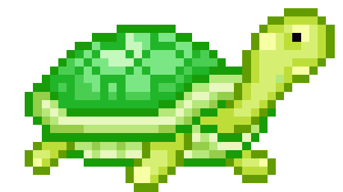
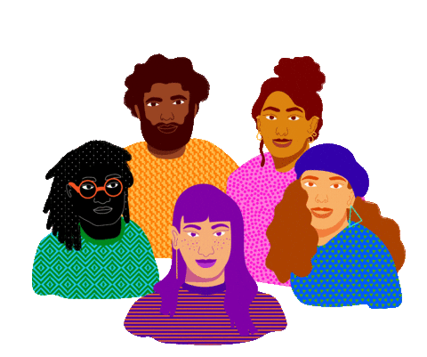

<h2> Hi there, I'm Ahmad </h2>
<p><em>
  Software Enginner at <a href="https://playproject.io/">PlayProject</a>
    
  </br>
  Blockchain Developer at <a href="https://gowhite.xyz/">White</a>
    
  </br>
  Doing Bachelor of Computer Science at <a href="https://uog.edu.pk/">University of Gujrat</a>
    
</em></p>


### A little more about me...

```javascript
const ahmad = {
  pronouns: "he" | "him",
  code: [Typescript, Rust, C, Elixir, Javascript, Go],
  tools: [React, Redux, Node/Bun, GTK/Rust, Docker],
  system: [Linux, CachyOS, GNOME, Wayland, Vicinae],
  challenge: "I am doing the #100DaysOfCode on C"
}
```

 <em><b>I love connecting with different people,</b> so if you want to say <b>hi</b>, I'd be happy to meet you!</em>


```
      ,---,      ,---,                     ,--,         ,---, 
    ,---.'|    ,---.'|  __  ,-.   ,---.  ,--.'|       ,---.'| 
    |   | :    |   | :,' ,'/ /|  '   ,'\ |  |,        |   | : 
    |   | |    |   | |'  | |' | /   /   |`--'_        |   | | 
  ,--.__| |  ,--.__| ||  |   ,'.   ; ,. :,' ,'|     ,--.__| | 
 /   ,'   | /   ,'   |'  :  /  '   | |: :'  | |    /   ,'   | 
.   '  /  |.   '  /  ||  | '   '   | .; :|  | :   .   '  /  | 
'   ; |:  |'   ; |:  |;  : |   |   :    |'  : |__ '   ; |:  | 
|   | '/  '|   | '/  '|  , ;    \   \  / |  | '.'||   | '/  ' 
|   :    :||   :    :| ---'      `----'  ;  :    ;|   :    :| 
 \   \  /   \   \  /                     |  ,   /  \   \  /   
  `----'     `----'                       ---`-'    `----'    
```
